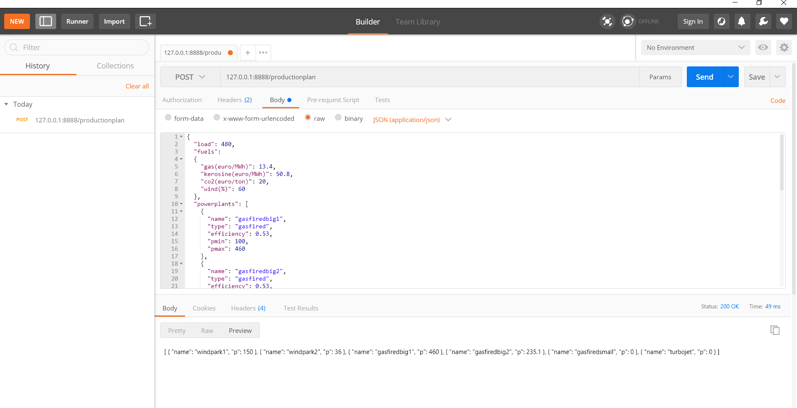

## Launching the API

The application was written in Python 3.8.9 with the use of Spyder 4.2.5. In order to launch it, first of all you need the 
"flask" web framework. Open the command prompt and use the package manager [pip](https://pip.pypa.io/en/stable/) to install it.
```bash
pip install flask
```
Then go to the folder where you have stored the file requirements.txt and install the packages with:
```bash
pip install -r requirements.txt
```
Finally, go to the folder where the file energy_plan.py is stored. In case you have only Python 3 installed on your PC type:
```bash
python energy_plan.py
```
In case you have both Python 2 and 3 installed on your PC type:
```bash
python3 energy_plan.py
```

## Algorithm v1.1.0
This project develops a two-stage algorithm aiming to solve the unit commitment problem 
of the powerplants. During the first stage, the powerplants are activated serially from 
the most cost-effective to the least cost-effective until the power demand is met. Thus, the order 
of activation is as follows:
#### windpark1 --> windpark2 --> gasfiredbig1 --> gasfiredbig2 --> gasfiredsmall --> turbojet
A powerplant has to reach full capacity before the next powerplant is activated and the windparks 
are brought into use only when the wind is not zero. The fluctuation in the price of fuels doesn't 
affect the aforementioned order, as the cost of energy production in the windparks is zero and gas 
is a much cheaper alternative than kerosine. The cost of CO2 emissions, which is also taken into 
account in the model, doesn't alter the situation. 

Often, there is no need to proceed to the second stage of the algorithm, as the first stage 
provides us with an optimal solution. Sometimes though, one of the 3 gas-fired powerplants is 
asked to produce below the minimum power it generates when turned on. In such cases, we change 
the resource allocation in the model in order to avoid overproduction. The serial activation makes 
it a rather simple task. For example, in order to increase the power provided by the 2nd big gas-fired 
plant and make it equal to its Pmin, we reduce proportionately the supply of the 1st big gas-fired 
plant. The same way, if we want to make the power of the small gas-fired plant equal to its Pmin 
we reduce proportionately the supply of 2nd big gas-fired plant. In the case of the 1st big gas-fired 
plant we have two options; either we substitute it with the small gas-fired plant or we reduce 
proportionately the supply of the big windpark. All these changes take place so as to ensure 
that the general supply in our system doesn't change and stays equal to the load.

## Testing the application
I used the browser version of Postman to test the algorithm. The payload is inserted as raw data 
having a structure similar to the files in the example_payloads folder. Please be careful to define
the type of the data as application/json. At the other end we are receiving a json object with the 
power stations and their respective power production.
